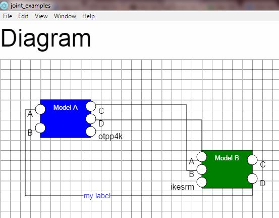

# Jointjs_electron

This is just a minimal example of how to create a desktop application using Electron and JointJS.

## I want to run it

1. Install NodeJS (with npm, of course)
1. npm install
1. npm start

## I want to debug it

1. Install VSCode
1. Open the folder of the project
1. Press F5

Many things can be broken about dependencies. I just configured it to run on my system. Just let me know about any silly stuff :P